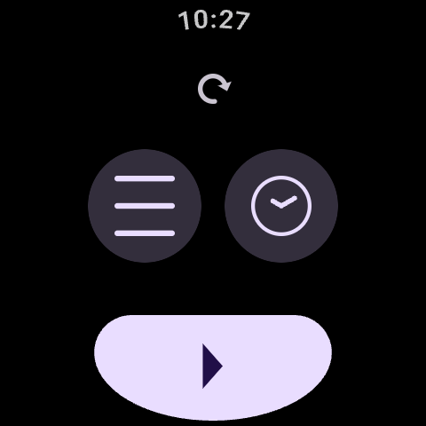
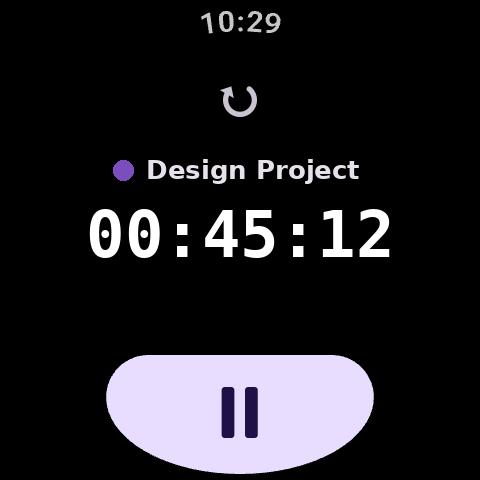
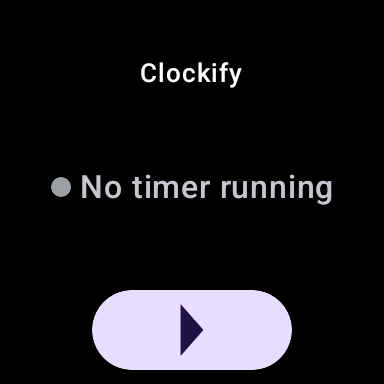
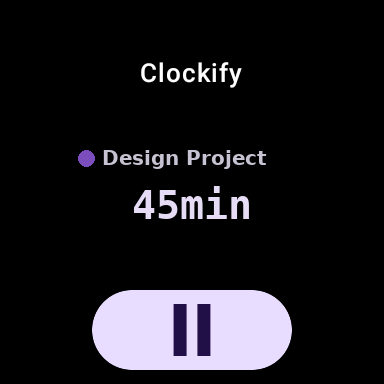

#  ClockifyWearOS

---

A [Clockify](https://clockify.me/) time-tracking client for Wear OS. Start and stop timers,
switch projects and tasks, and see the running entry on your wrist, without reaching for your
phone.

## Screenshots

|                 | Idle                                                  | Running                                                     |
| --------------- | ------------------------------------------------------ | ------------------------------------------------------------ |
| **Main screen** |  |  |
| **Tile**        |          |           |

Project names and elapsed times shown above are placeholders.

## Requirements

- A Wear OS 3+ watch (Android API 30 or newer)
- A [Clockify](https://clockify.me/) account and its API key, from **Profile settings** on
  clockify.me

Clockify has no official OAuth flow for third-party apps, so signing in means entering that API
key once, on the watch. See [Known limitations](#known-limitations) below.

## Installation

Not yet published to the Play Store (see [docs/RELEASING.md](docs/RELEASING.md) for the release
pipeline). Until then:

- **Prebuilt APK**: grab the latest APK from [Releases](https://github.com/nikosavola/ClockifyWearOS/releases)
  and sideload it with `adb install`.
- **Build from source**: see [Contributing](#contributing) below.

## Configuration

Open **Settings** on the watch (swipe left from the main screen) and paste your Clockify API
key. Typing a ~48-character key with the watch's own keyboard is painful, so the field also
accepts a paste from your phone's clipboard, which syncs to the watch automatically on Wear OS.

## Features

- **Start/stop timers** for any project and task, with the running entry's elapsed time shown
  live on the watch face
- **Project and task pickers**, plus a recents list for quickly restarting a previous entry
- **Tile** with a Play/Pause button and a **complication** so the running timer is visible
  without opening the app
- **Ongoing notification** while a timer runs, matching Wear OS's guidelines for
  long-running activities
- **Dynamic color** theming, following the system's Wear OS theme
- Translated into English, Finnish, Swedish, German, French, Russian, Japanese, Chinese
  (Simplified and Traditional), and Latin

## Known limitations

- **On-watch sign-in.** Clockify has no OAuth flow this app can use without becoming an
  official Marketplace partner with a backend of its own, so the only way to sign in is typing
  or pasting an API key directly on the watch. This is a rougher experience than typical Wear OS
  sign-in flows, and is an accepted trade-off rather than an oversight.
- **No phone companion app.** Everything, including sign-in, happens on the watch itself.

## Contributing

See [CONTRIBUTING.md](CONTRIBUTING.md) for development setup (via [`just`](https://just.systems/))
and guidelines, and [CODE_OF_CONDUCT.md](CODE_OF_CONDUCT.md) for community expectations. Found a
security issue? See [SECURITY.md](SECURITY.md) instead of opening a public issue.

## Versioning

Version numbers follow [ZeroVer](https://0ver.org/): the major version stays at 0 indefinitely,
so a 0.y bump can carry breaking changes.

## License

[Apache License 2.0](LICENSE).
